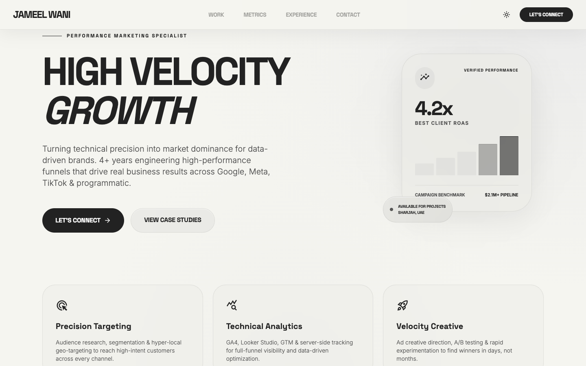
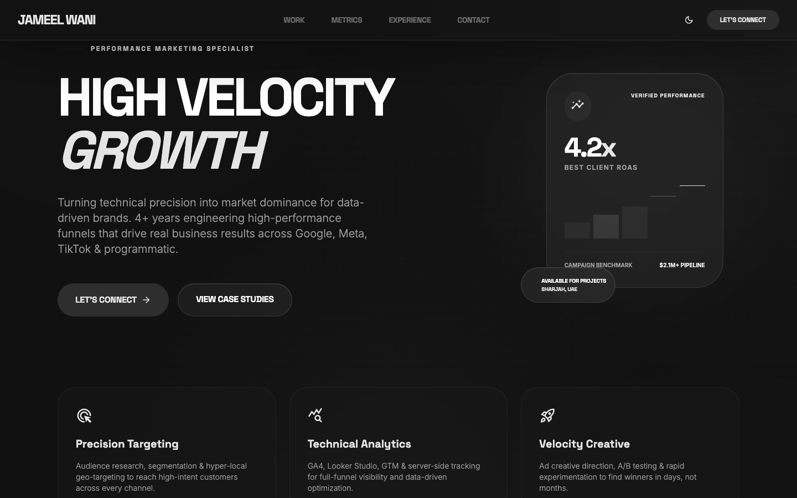
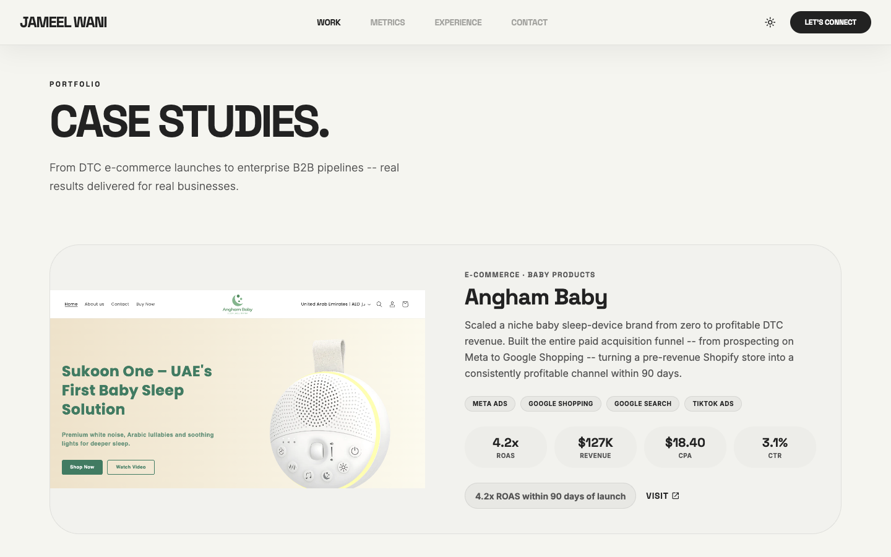
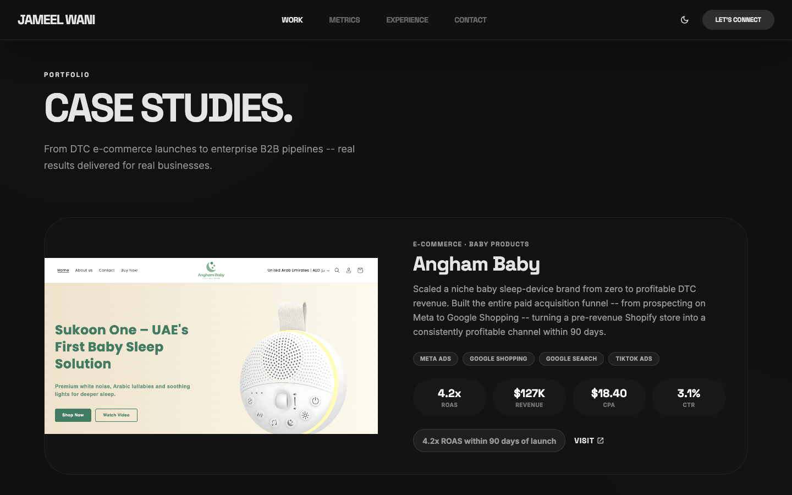
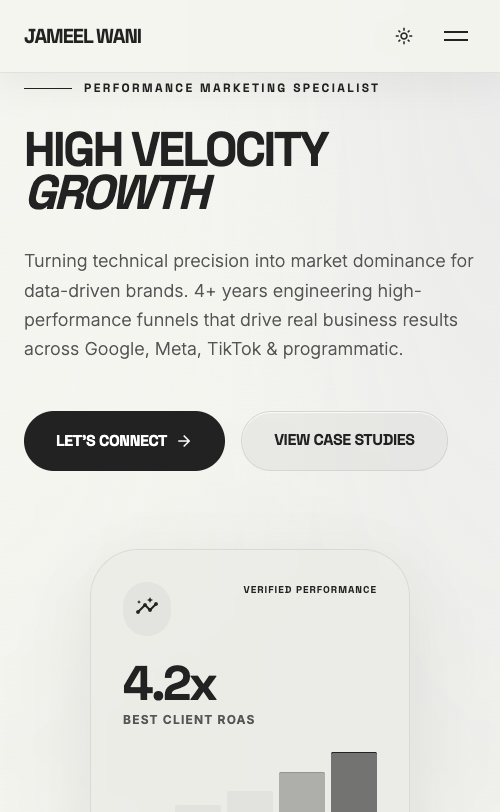
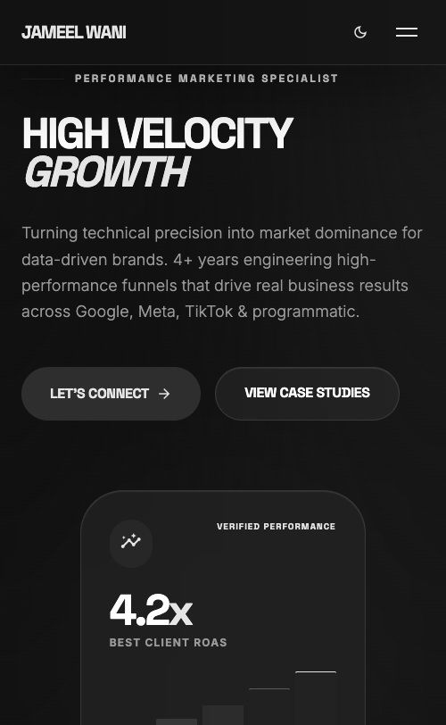

# Jameel Wani - Portfolio

Personal portfolio website for **Jameel Wani**, a Performance Marketing Specialist with 4+ years of experience driving measurable growth across Google Ads, Meta, TikTok, and programmatic platforms.

**Live:** [jameelaltaf.github.io](https://jameelaltaf.github.io)

---

## Preview

### Desktop

| Light Mode | Dark Mode |
|:---:|:---:|
|  |  |

### Case Studies

| Light Mode | Dark Mode |
|:---:|:---:|
|  |  |

### Mobile

| Light Mode | Dark Mode |
|:---:|:---:|
|  |  |

---

## Features

- **Single-page design** - smooth scroll navigation between sections
- **Dark / Light mode** - toggle with persistence via localStorage
- **Fully responsive** - optimized for desktop, tablet, and mobile
- **Monochrome design system** - off-white light mode, dark mode, uniform typography
- **Animated metrics** - counter animations on scroll using IntersectionObserver
- **5 real case studies** - with live website screenshots and campaign metrics
- **Experience timeline** - professional history with alternating layout
- **Contact form** - with direct email, phone, and LinkedIn links
- **Resume download** - PDF available directly from the site

---

## Sections

| Section | Description |
|---------|-------------|
| **Hero** | Headline, bio, CTAs, floating metric card |
| **Metrics** | 35% CPL reduction, +77% conversion rate lift, 400+ leads/month |
| **Case Studies** | Angham Baby, Nishchay Photography, Artistry by Rhythm, T360 Pay, Muraflex |
| **Experience** | Think Shift, Tezooo Innovations, Muraflex + skills grid |
| **Testimonials** | Client quotes with star ratings |
| **Contact** | Email, phone, LinkedIn, location, resume download, contact form |

---

## Tech Stack

| Layer | Technology |
|-------|-----------|
| **Markup** | HTML5 (semantic) |
| **Styling** | Tailwind CSS v3 (CDN) |
| **Typography** | Space Grotesk (headlines), Inter (body) via Google Fonts |
| **Icons** | Material Symbols Outlined |
| **JavaScript** | Vanilla JS (~170 lines) |
| **Animations** | CSS transitions + IntersectionObserver |
| **Hosting** | GitHub Pages |
| **Analytics** | Google Analytics 4 |

No build tools, no frameworks, no dependencies. Just static HTML/CSS/JS served directly via GitHub Pages.

---

## Project Structure

```
jameelaltaf.github.io/
  index.html                  # Single-page site (all sections)
  js/
    main.js                   # Theme toggle, scroll animations, mobile menu, counters
  assets/
    jameel-wani-photo.png     # Profile photo
    Jameel_Wani_Resume.pdf    # Downloadable resume
    screenshots/              # Client website screenshots
      angham-baby.png
      nishchay-photography.png
      artistry-by-rhythm.png
      t360pay.png
      muraflex.png
    readme/                   # README preview images
```

---

## Running Locally

```bash
git clone https://github.com/jameelaltaf/jameelaltaf.github.io.git
cd jameelaltaf.github.io
python3 -m http.server 8080
# Open http://localhost:8080
```

---

## Case Studies

| Client | Industry | Key Result | Duration |
|--------|----------|------------|----------|
| **Angham Baby** | E-Commerce | 4.2x ROAS, $127K revenue | 6 months |
| **Nishchay Photography** | Local Services | 340+ leads, 53% CPL reduction | 8 months |
| **Artistry by Rhythm** | Beauty / MUA | 480+ enquiries, fully booked 2mo early | 10 months |
| **T360 Pay** | B2B Fintech | $385K pipeline, 9x ad spend ROI | 12 months |
| **Muraflex** | B2B Manufacturing | $2.1M+ pipeline from $38K budget | 9 months |

---

## Contact

- **Email:** jameelaltafw@gmail.com
- **Phone:** (+971) 508-057658
- **LinkedIn:** [linkedin.com/in/jameelwani](https://linkedin.com/in/jameelwani)
- **Location:** Sharjah, UAE

---

## License

Copyright 2026 Jameel Wani. All rights reserved.
